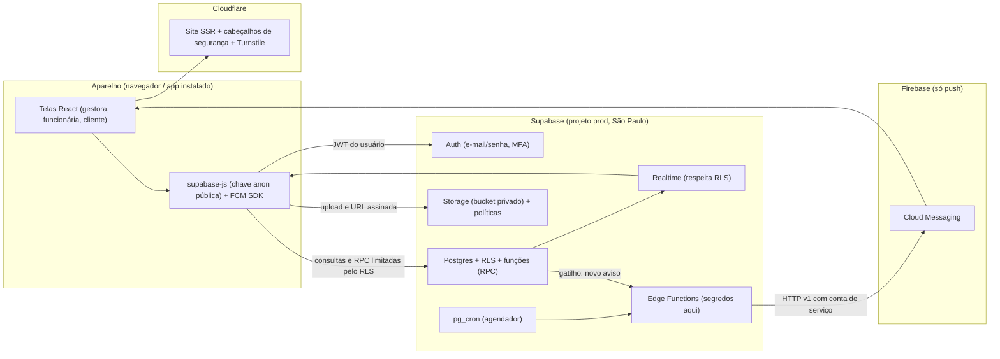

# Arquitetura do EstetBoost. (system design)

Documento de projeto. **Nada aqui está implementado ainda**: hoje o app roda sem banco (`localStorage` e IndexedDB). Esta é a arquitetura que vai substituir essa camada, sem mudar as telas.

Documentos irmãos: [Segurança e privacidade](./SEGURANCA-PRIVACIDADE.md) · [Modelo do banco e RLS](./SUPABASE-MODELO-E-RLS.md) · [Fluxos](./FLUXOS.md) · [Equipe e permissões](./EQUIPE-E-PERMISSOES.md) · [Docker e deploy](./AMBIENTE-DOCKER-E-DEPLOY.md) · [Guia do painel Supabase](./SUPABASE-CONSOLE-GUIA.md) · [Notificações e push](./NOTIFICACOES-FIREBASE.md) · [Próxima etapa](./PROXIMA-ETAPA.md).

## 1. Decisões

| Tema                               | Decisão                                                                            | Por quê                                                                                                                                            |
| ---------------------------------- | ---------------------------------------------------------------------------------- | -------------------------------------------------------------------------------------------------------------------------------------------------- |
| Banco, login, arquivos, tempo real | **Supabase** (Postgres, Auth, Storage, Realtime, Edge Functions), região São Paulo | Banco relacional serve bem a caixa, estoque e relatórios; segurança por linha (RLS) no próprio banco; o Lovable tem integração nativa com Supabase |
| Push no celular                    | **Firebase Cloud Messaging (FCM)** apenas                                          | É o serviço de push do Google; o projeto Firebase existe só para isso (sem Firestore, Auth ou Storage do Firebase)                                 |
| Site (SSR)                         | **Cloudflare**, publicado pelo Lovable a cada push no GitHub                       | É o alvo do build atual (TanStack Start + Nitro)                                                                                                   |
| Docker                             | **Só local e testes** (`supabase start` roda a pilha completa em Docker)           | Testar tudo sem tocar em dados reais e sem custo                                                                                                   |
| Plano                              | **Supabase Pro** em produção (conferir preço e limites atuais)                     | O plano gratuito pausa projetos inativos e não é adequado a dados reais; backups diários entram no Pro e recuperação pontual (PITR) é um adicional |
| Ambientes                          | Local (Docker), `staging` e `prod` (dois projetos Supabase)                        | Nunca testar em produção; chaves diferentes por ambiente                                                                                           |

## 2. Visão geral

### O que cada peça faz

- **Telas (React)**: só mostram e coletam. Nunca decidem permissão; o banco revalida tudo.
- **`src/services/*`** (já existem): continuam sendo o único lugar que grava. Hoje gravam em `createStore`; depois chamam o Supabase (consulta/RPC). As assinaturas das funções não mudam, por isso as telas não mudam.
- **`createStore` (`src/lib/db.ts`)**: vira cache de leitura em memória alimentado por consulta inicial + Realtime. O `useSyncExternalStore` das telas permanece.
- **Cloudflare/SSR**: entrega o site, injeta cabeçalhos de segurança (`src/server.ts`) e hospeda o desafio Turnstile (anti-robô). Não guarda dados.
- **Supabase Auth**: identidade (e-mail e senha, recuperação, MFA). Guarda o hash da senha; o app nunca vê senha.
- **Postgres + RLS**: dados isolados por clínica. **As políticas RLS são a barreira real**: mesmo com a chave pública, ninguém lê ou grava o que a política nega.
- **Funções SQL (RPC, `SECURITY DEFINER`)**: operações que mexem em várias tabelas de uma vez (fechar atendimento, confirmar pagamento, aceitar credencial). São **atômicas**: ou tudo acontece, ou nada.
- **Storage**: fotos em bucket **privado**, com políticas por clínica e URL assinada de vida curta.
- **Edge Functions**: o que precisa de segredo ou de serviço externo (enviar push pelo FCM, e-mails). Segredos ficam nas _secrets_ da função, nunca no navegador.
- **pg_cron**: lembretes agendados (`runReminders()` hoje roda a cada 60 s com o app aberto; na nuvem roda a cada 5 min mesmo com o app fechado).
- **FCM (Firebase)**: entrega o push. Preferências e `ruleKey` seguem [NOTIFICACOES-FIREBASE.md](./NOTIFICACOES-FIREBASE.md).

## 3. Modelo de acesso (resumo)

Três papéis. O papel e a clínica de cada pessoa ficam na tabela `profiles`, **gravada só pelo servidor**, e as políticas RLS consultam essa tabela (assim, desativar uma pessoa vale na hora, sem esperar o token expirar).

| Papel         | Enxerga                                                                                                    |
| ------------- | ---------------------------------------------------------------------------------------------------------- |
| `gestor`      | Tudo da própria clínica, inclusive financeiro e equipe                                                     |
| `funcionario` | Tudo da clínica **menos financeiro e administração** (ver [Equipe e permissões](./EQUIPE-E-PERMISSOES.md)) |
| `cliente`     | Só os próprios dados, horários, cobranças, fotos e recomendações                                           |
| (sem login)   | Só a página pública de cadastro por link, e nada de dados                                                  |

> Atenção: **nunca** use `user_metadata` para decidir permissão. O usuário consegue editar o próprio `user_metadata`. A autorização usa `profiles` (e, se necessário, `app_metadata`, que só o servidor escreve).

## 4. O que passa por função no servidor

| Função                                                     | Tipo                    | Por que no servidor                                                                                                |
| ---------------------------------------------------------- | ----------------------- | ------------------------------------------------------------------------------------------------------------------ |
| `create_clinic`                                            | RPC                     | Cria clínica e perfil `gestor` numa só operação, para o usuário logado                                             |
| `create_invite` / `create_staff_invite`                    | RPC                     | Só gestora; gera o código e grava só o hash                                                                        |
| `accept_invite` / `accept_staff_invite`                    | RPC                     | Valida credencial (hash, validade, uso único, limite de tentativas), cria `clients` ou `profiles`, filia à clínica |
| `complete_session`                                         | RPC                     | Transação: atendimento, caixa, estoque, agenda, cuidados, avisos, auditoria                                        |
| `edit_finished_session` / `delete_finished_session`        | RPC                     | Corrige caixa, agenda e estoque juntos                                                                             |
| `confirm_payment` / `reject_payment` / `reopen_receivable` | RPC                     | Só a gestora; a cliente jamais confirma o próprio pagamento                                                        |
| `disable_staff`                                            | RPC + Edge Function     | Desativa perfil e revoga sessões                                                                                   |
| `export_client_data` / `delete_client_data`                | Edge Function           | Direitos do titular (LGPD), com auditoria                                                                          |
| `send_push`                                                | Edge Function           | Único lugar com a conta de serviço do FCM                                                                          |
| Agendadas                                                  | pg_cron → Edge Function | Lembretes, vencimentos, validade de produto, limpeza de credenciais expiradas                                      |

O que **pode** ser escrito direto pelo navegador, sob políticas estritas: rascunho de atendimento, cadastro de cliente (equipe), pedido de horário (cliente), preferências, anotações próprias.

## 5. Mapeamento do que existe hoje para o que vem

| Hoje                                    | Arquivo                                                                           | Depois                                                          |
| --------------------------------------- | --------------------------------------------------------------------------------- | --------------------------------------------------------------- |
| Sessão em `eb.session`                  | `src/lib/session.ts`                                                              | Supabase Auth (`onAuthStateChange`) + `profiles`                |
| `demoAccounts`, `enterAs`, `FreeAccess` | `src/data/mock-auth.ts`, `src/components/auth/free-access.tsx`, `auth.service.ts` | **Removidos** em produção; contas de teste só no Supabase local |
| Credenciais em `estetboost:convites:*`  | `src/lib/invites-store.ts`                                                        | Tabela `invites` com hash, validade e uso único                 |
| Stores locais                           | `src/data/db.ts`                                                                  | Tabelas Postgres por clínica                                    |
| Fotos em IndexedDB                      | `src/lib/photo-store.ts`                                                          | Supabase Storage + tabela `photos`                              |
| `notify()` e `runReminders()`           | `src/services/notify.ts`, `reminders.ts`                                          | Funções SQL/Edge + pg_cron                                      |
| `activityDb`                            | `src/data/db.ts`                                                                  | Tabela `activity` append-only                                   |
| Preferências                            | `prefsDb`                                                                         | Tabela `prefs`                                                  |
| Push local                              | `src/services/push.service.ts`                                                    | Token FCM em `push_tokens`                                      |

## 6. Ambientes e configuração

| Ambiente | Onde roda                                               | Dados                      | Segredos                  |
| -------- | ------------------------------------------------------- | -------------------------- | ------------------------- |
| Local    | Docker (`supabase start`)                               | Seed de teste, descartável | Nenhum segredo real       |
| Staging  | Projeto Supabase `estetboost-staging` + preview do site | Dados fictícios            | Próprios                  |
| Produção | Projeto Supabase `estetboost-prod` + site publicado     | Dados reais                | Próprios, acesso restrito |

- Variáveis `VITE_*` carregam **apenas** o que é público: URL do projeto, **chave `anon`**, site key do Turnstile e config web do FCM.
- **Nunca** no navegador: a chave **`service_role`** (ignora todas as políticas RLS), a senha do banco, o JWT secret, a conta de serviço do FCM. Ficam em _secrets_ das Edge Functions e no painel da Cloudflare, e jamais no repositório.

## 7. Custos (ordem de grandeza)

- Supabase Pro tem custo mensal fixo (conferir o valor atual no site) com cota de banco, arquivos e usuários; fotos são o que mais cresce (reduzir no envio, como `shrinkImage` já faz).
- FCM é gratuito.
- Cloudflare: o plano gratuito atende no início; domínio é custo anual.
- Configurar **alerta de uso/gasto** no Supabase antes de abrir a clientes reais.

## 8. Decisões já fechadas e em aberto

Fechadas: clínica com equipe (funcionária sem financeiro) · sem cobrança Pix automática, apenas link/código de pagamento que a gestora cadastra e a cliente copia · banco Supabase, push no Firebase · aviso de novo horário para toda a equipe.

Em aberto:

1. Domínio próprio e e-mail que envia convites e recuperação de senha (Supabase Auth precisa de um remetente SMTP próprio em produção).
2. Contato do encarregado de dados (LGPD).
3. Criar o projeto Supabase **pela integração do Lovable** ou **direto na sua conta Supabase**. Recomendação: direto na sua conta (a organização e os dados ficam sob o seu controle) e conectar ao Lovable, se ele oferecer. As migrações do banco ficam no repositório (`supabase/migrations`).
4. Cookie de sessão httpOnly (mais seguro contra XSS, exige trabalho no servidor) ou token do SDK no navegador. Recomendação: começar com o SDK + CSP rígida.
