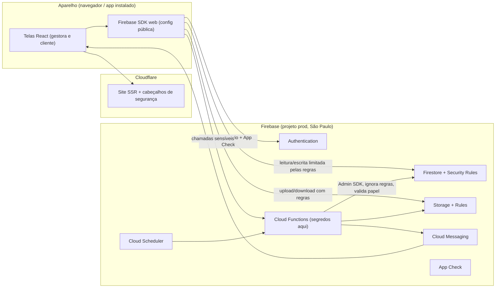

# Arquitetura do EstetBoost. (system design)

> **Equipe:** a clínica pode ter funcionárias (papel `funcionario`, sem financeiro). Ver [Equipe e permissões](./EQUIPE-E-PERMISSOES.md), que complementa §3 e §4.
> Documento de projeto. **Nada aqui está implementado ainda**: hoje o app roda sem banco (`localStorage` e IndexedDB). Esta é a arquitetura que vai substituir essa camada, sem mudar as telas.

Documentos irmãos: [Segurança e privacidade](./SEGURANCA-PRIVACIDADE.md) · [Modelo do Firestore e regras](./FIRESTORE-MODELO-E-REGRAS.md) · [Fluxos](./FLUXOS.md) · [Docker e deploy](./AMBIENTE-DOCKER-E-DEPLOY.md) · [Guia do console Firebase](./FIREBASE-CONSOLE-GUIA.md).

## 1. Decisões

| Tema                           | Decisão                                                                                                | Por quê                                                                                                |
| ------------------------------ | ------------------------------------------------------------------------------------------------------ | ------------------------------------------------------------------------------------------------------ |
| Banco, login, arquivos, avisos | **Firebase** (Auth, Firestore, Storage, Cloud Functions, FCM), região `southamerica-east1` (São Paulo) | Escolha do projeto; dados no Brasil ajudam na LGPD e na latência                                       |
| Site (SSR)                     | **Cloudflare**, publicado pelo Lovable a cada push no GitHub                                           | É o alvo do build atual (TanStack Start + Nitro). CDN e proteção contra ataques de volume já incluídas |
| Docker                         | **Só local e testes** (Firebase Emulator Suite)                                                        | Testar tudo sem tocar em dados reais e sem custo                                                       |
| Plano Firebase                 | **Blaze** (pago por uso) com alerta de orçamento                                                       | Cloud Functions exige Blaze; o uso inicial costuma caber na cota gratuita                              |
| Ambientes                      | 3 projetos Firebase: `dev` (emulador), `staging`, `prod`                                               | Nunca testar em produção; credenciais diferentes por ambiente                                          |

## 2. Visão geral

### O que cada peça faz

- **Telas (React)**: só mostram e coletam. Nunca decidem permissão; tudo que importa é revalidado no servidor.
- **`src/services/*`** (já existem): continuam sendo o único lugar que grava. Hoje gravam em `createStore`; depois chamam Firestore ou uma Cloud Function. As assinaturas das funções não mudam, por isso as telas não mudam.
- **`createStore` (`src/lib/db.ts`)**: vira cache de leitura em memória alimentado por `onSnapshot` do Firestore. O `useSyncExternalStore` das telas permanece.
- **Cloudflare/SSR**: entrega o site e injeta cabeçalhos de segurança (`src/server.ts`). Não guarda dados.
- **Firebase Auth**: identidade (e-mail e senha, recuperação, MFA opcional). Guarda o hash da senha; o app nunca vê senha.
- **Firestore**: dados da clínica, isolados por `clinicId`. As Security Rules são a barreira real.
- **Storage**: fotos. Acesso só por regras e por URL assinada de vida curta.
- **Cloud Functions**: único lugar com segredos e permissão total. Fazem o que o navegador não pode decidir sozinho (ver §4).
- **Cloud Scheduler + Functions**: lembretes (`runReminders()` hoje roda a cada 60 s no app aberto; na nuvem roda a cada 5 min mesmo com o app fechado).
- **FCM**: push no celular. Preferências e `ruleKey` seguem `docs/NOTIFICACOES-FIREBASE.md`.
- **App Check**: confirma que a chamada vem do app verdadeiro, não de um script.

## 3. Modelo de acesso (resumo)

Três papéis, definidos no servidor e gravados como **custom claims** no token do usuário:

| Papel            | Claims                                 | Enxerga                                                          |
| ---------------- | -------------------------------------- | ---------------------------------------------------------------- |
| `gestor`         | `role=gestor`, `clinicId`              | Tudo da própria clínica                                          |
| `cliente`        | `role=cliente`, `clinicId`, `clientId` | Só os próprios dados, horários, cobranças, fotos e recomendações |
| (ninguém logado) | nenhum                                 | Só a página pública de cadastro por link, e nada de dados        |

Claims só são escritas por Cloud Function (Admin SDK). O navegador não consegue criá-las nem alterá-las.

## 4. O que passa por Cloud Function (nunca direto do navegador)

| Função (callable)                       | Por que no servidor                                                                                            |
| --------------------------------------- | -------------------------------------------------------------------------------------------------------------- |
| `createClinic`                          | Cria clínica, vincula o usuário e define claims numa só operação                                               |
| `acceptInvite`                          | Valida credencial (hash, validade, uso único), cria `clients`, filia à clínica, define claims, avisa a gestora |
| `completeSession`                       | Transação: marca atendimento, lança caixa, baixa estoque, atualiza agenda, avisa. Tudo ou nada                 |
| `confirmPayment` / `rejectPayment`      | Só a gestora da clínica; cliente jamais confirma o próprio pagamento                                           |
| `exportClientData` / `deleteClientData` | Direitos do titular (LGPD), com registro de auditoria                                                          |
| `signedPhotoUrl`                        | URL de foto com vida curta, só se a cliente autorizou                                                          |
| Gatilhos (`onWrite`)                    | Gerar notificações a partir do catálogo `notification-events.ts` e registrar auditoria                         |
| Agendadas                               | Lembretes, vencimentos, validade de produto, backup                                                            |

O que **pode** ser escrito direto pelo navegador, sob regras estritas: rascunho de atendimento, edição de cadastro de cliente (gestora), pedido de horário (cliente), preferências de notificação, anotações próprias.

## 5. Mapeamento do que existe hoje para o que vem

| Hoje                                    | Arquivo                                                                           | Depois                                                    |
| --------------------------------------- | --------------------------------------------------------------------------------- | --------------------------------------------------------- |
| Sessão em `eb.session`                  | `src/lib/session.ts`                                                              | Firebase Auth (`onAuthStateChanged`) + claims             |
| `demoAccounts`, `enterAs`, `FreeAccess` | `src/data/mock-auth.ts`, `src/components/auth/free-access.tsx`, `auth.service.ts` | **Removidos** em produção; contas de teste só no emulador |
| Credenciais em `estetboost:convites:*`  | `src/lib/invites-store.ts`                                                        | Coleção `invites` com hash, validade e uso único          |
| Stores locais                           | `src/data/db.ts`                                                                  | Coleções Firestore por clínica                            |
| Fotos em IndexedDB                      | `src/lib/photo-store.ts`                                                          | Cloud Storage + metadados no Firestore                    |
| `notify()` e `runReminders()`           | `src/services/notify.ts`, `reminders.ts`                                          | Gatilhos e agendador em Cloud Functions                   |
| `activityDb`                            | `src/data/db.ts`                                                                  | Log de auditoria append-only                              |
| Preferências                            | `prefsDb`                                                                         | `users/{uid}/prefs`                                       |

## 6. Ambientes e configuração

| Ambiente | Onde roda                                               | Dados                      | Segredos                          |
| -------- | ------------------------------------------------------- | -------------------------- | --------------------------------- |
| Local    | Docker Compose com Emulator Suite                       | Seed de teste, descartável | Nenhum segredo real               |
| Staging  | Projeto Firebase `estetboost-staging` + preview do site | Dados fictícios            | Secrets próprios                  |
| Produção | Projeto Firebase `estetboost-prod` + site publicado     | Dados reais                | Secrets próprios, acesso restrito |

- Variáveis `VITE_*` carregam **apenas** configuração pública (ids do projeto, chave web, site key do App Check).
- Segredos (conta de serviço, chaves de e-mail) ficam em **Firebase Secret Manager** (Functions) e **secrets do Cloudflare** (SSR), nunca no repositório.

## 7. Custos (ordem de grandeza)

- Firestore, Auth, Storage e Functions têm cota gratuita mensal; para uma clínica pequena o custo inicial tende a ser baixo.
- O que mais pesa no futuro: leituras do Firestore (por isso `onSnapshot` com consultas limitadas e índices) e armazenamento de fotos (reduzir no envio, como `shrinkImage` já faz).
- Configurar **alerta de orçamento** no Google Cloud antes de abrir para clientes reais.

## 8. Decisões em aberto (precisam de resposta antes de implementar)

1. Cookie de sessão httpOnly (mais seguro contra XSS, exige função de servidor no Cloudflare) **ou** token do SDK no navegador (mais simples). Recomendação: começar com o SDK + CSP rígida e migrar para cookie se houver SSR autenticado.
2. Uma clínica pode ter várias profissionais (equipe)? Muda o modelo de `users` e regras. Hoje é uma gestora por clínica.
3. Cobrança online (Pix com baixa automática) entra nesta fase ou depois?
4. Domínio próprio e e-mail transacional (para credenciais e recuperação de senha).

## 9. Conector Firebase do Lovable: usar ou não?

O Lovable oferece um conector oficial apenas para **Firebase Cloud Messaging** (push), em que se envia a chave JSON do projeto e ela fica guardada como segredo. Não há conector oficial para Auth, Firestore e regras. Por isso a recomendação é:

- **Auth, Firestore, Storage, regras e Functions: direto no Firebase**, como descrito acima. Só assim as regras de segurança, os papéis (claims) e os testes no emulador ficam sob nosso controle.
- **Push (FCM)**: o conector do Lovable pode servir para enviar avisos, mas o agendador e os gatilhos já ficam nas Cloud Functions; usar um segundo caminho duplicaria a lógica. Decidir na implementação; padrão: FCM pelas Cloud Functions.
- Em qualquer caso, **a chave JSON da conta de serviço nunca é colada no chat nem no código**: só em Secret Manager (Functions) ou no campo de segredo do Lovable/Cloudflare.
