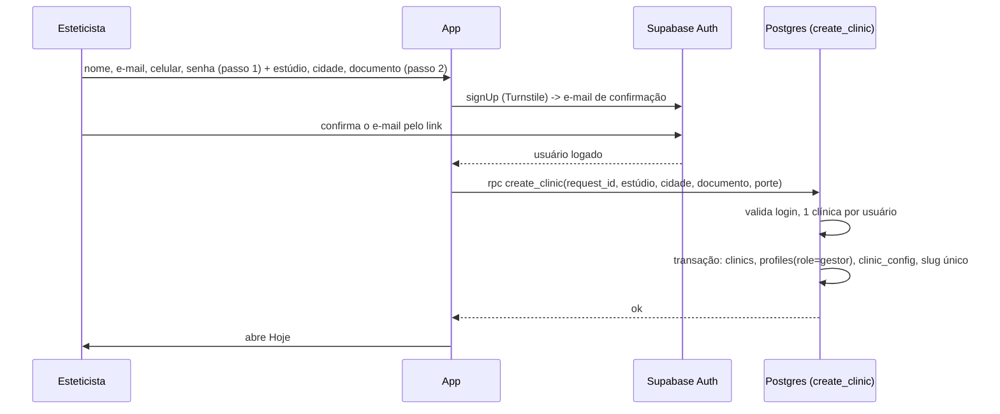
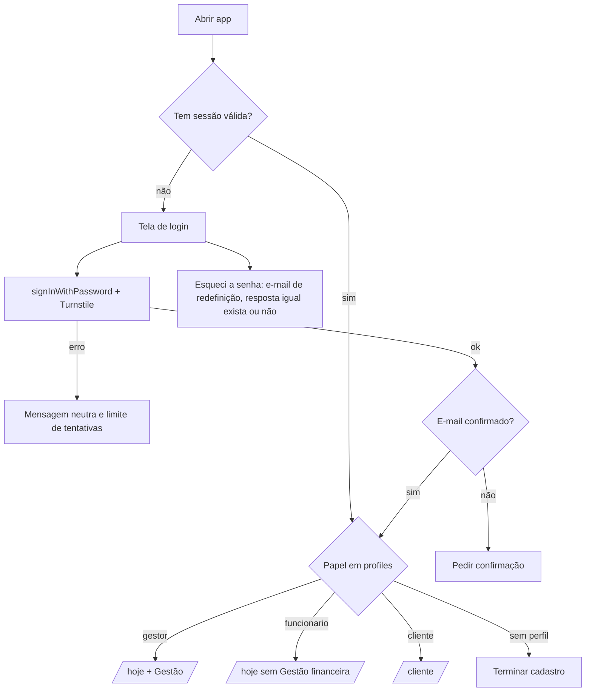
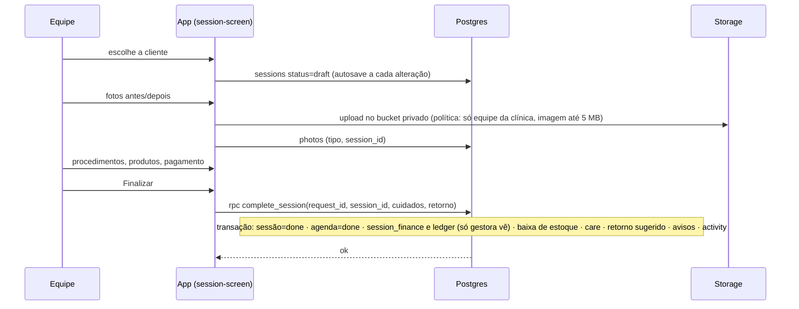
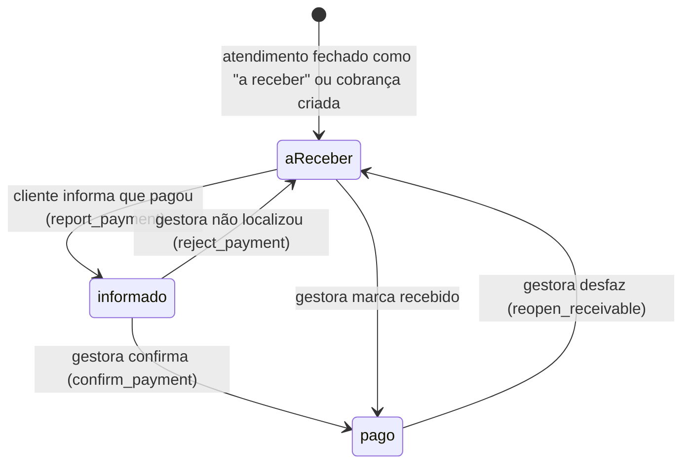
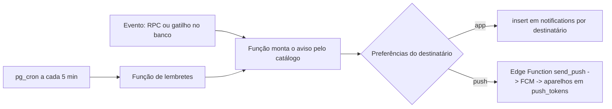

# Mapa de fluxos do EstetBoost.

Projeto. Cada fluxo mostra quem chama, o que valida o servidor, o que é atômico e o que acontece se falhar. Os nomes `create_clinic`, `accept_invite`… são as RPCs (funções do Postgres) descritas em [SUPABASE-MODELO-E-RLS.md](./SUPABASE-MODELO-E-RLS.md) §4. As telas e serviços citados já existem no app. Papéis e o que a funcionária não vê: [EQUIPE-E-PERMISSOES.md](./EQUIPE-E-PERMISSOES.md).

Regras gerais de robustez:

- **Idempotência**: toda RPC recebe um `request_id`; repetir a chamada (rede ruim, toque duplo) não duplica nada.
- **Atomicidade**: o que mexe em várias tabelas (fechar atendimento, confirmar pagamento) roda dentro de **uma função do Postgres**, que é transacional: ou tudo, ou nada.
- **Falha visível**: erro de servidor vira mensagem clara na tela e nada fica pela metade.
- **Offline**: leituras vêm do cache; o rascunho de atendimento guarda localmente e sincroniza ao voltar.

## 1. Criar conta da esteticista (nasce a clínica)

Tela: `components/auth/signup-flow.tsx` (2 passos).



Falhas tratadas: e-mail já existe (mensagem neutra), a pessoa confirma o e-mail mas fecha o app antes de criar a clínica (no próximo login o app mostra "terminar cadastro" e repete `create_clinic` com o mesmo `request_id`), slug em uso (gera `studio-bia-2`). Os dados do passo 2 ficam guardados no aparelho até a clínica ser criada.

## 2. Cadastro da cliente por link ou credencial

Telas: link `/?p=slug` e `/?convite=CODIGO` → `components/auth/client-invite-form.tsx`. Credenciais são geradas em Credenciais/Configurações (`components/eb/client-invite.tsx`).

```mermaid
sequenceDiagram
  participant G as Gestora
  participant C as Cliente
  participant App as App
  participant Auth as Supabase Auth
  participant DB as Postgres
  G->>DB: rpc create_invite(nome?, celular?)
  DB->>DB: grava só o hash, validade 7 dias; devolve o código uma vez
  G->>C: envia link ou código (WhatsApp)
  C->>App: abre o link (nome público da clínica via slug)
  C->>App: nome, celular, e-mail, senha
  App->>Auth: signUp (Turnstile) -> confirma o e-mail
  Auth-->>App: logada (o código volta no link de confirmação)
  App->>DB: rpc accept_invite(request_id, código|slug, dados)
  DB->>DB: válido, não usado, não expirado, não cancelado, limite de tentativas
  DB->>DB: transação: clients (clinic_id), profiles(role=cliente), marca uso
  DB->>DB: notifications (gestora: nova cliente; cliente: boas-vindas), activity
  DB-->>App: ok, entra na área da cliente
```

Regras: resposta **genérica** a código inválido; cadastro pelo link fixo não precisa de código, mas tem limite por conta e IP; a filiação vem do servidor. Se a cliente já foi cadastrada pela gestora (mesmo e-mail), `accept_invite` **vincula** ao registro existente em vez de duplicar.

## 2b. Entrada da funcionária (credencial de equipe)

Mesmo desenho do fluxo 2, com `create_staff_invite` e `accept_staff_invite`: credencial de 48 h, amarrada ao e-mail, uso único, e-mail verificado, MFA recomendado. Detalhes em [EQUIPE-E-PERMISSOES.md](./EQUIPE-E-PERMISSOES.md) §3.

## 3. Login, sessão e recuperação



- O token renova sozinho a cada hora; se a conta for desativada, o RLS já bloqueia os dados e o app volta ao login.
- `RoleGate` (já existe) passa a ler o papel de `profiles`, nunca de dado editável.

## 4. Horários (agenda)

```mermaid
stateDiagram-v2
  [*] --> pendente: cliente solicita (insert com RLS)
  [*] --> confirmado: equipe agenda
  pendente --> confirmado: equipe aprova
  pendente --> cancelado: equipe recusa
  confirmado --> confirmado: cliente confirma presença
  confirmado --> remarcacao: cliente propõe nova data (request_reschedule)
  remarcacao --> confirmado: equipe aprova ou recusa
  confirmado --> cancelado: cancelamento (>24 h direto; <24 h pede aprovação)
  confirmado --> realizado: atendimento finalizado
```



- Disponibilidade vem de `clinic_config.hours`, `blocks` e horários ocupados (`lib/availability.ts`). **No servidor**, uma restrição única (`clinic_id, date, time` para horários ativos) impede dois pedidos no mesmo horário: o segundo recebe "horário ocupado".
- Cada passo grava `activity` e gera aviso pelo catálogo `notification-events.ts` (para toda a equipe).

## 5. Atendimento (rascunho até o fechamento)



Falhas tratadas: estoque insuficiente (RPC devolve `{ok:false, motivo}` com o produto), fechar duas vezes (idempotente por `session_id`), sem internet no fechamento (botão fica pendente e reenvia; o rascunho nunca se perde).

Para a funcionária, a etapa de produtos não mostra custo e o resumo financeiro não aparece; o valor vem do procedimento e o lançamento é feito pelo servidor. Correção e exclusão de atendimento finalizado também são RPCs.

## 6. Pagamentos



- **Sem cobrança automática**: a gestora cadastra em Configurações um link/código de pagamento (`clinic_config.payment_info`); a cliente vê o botão **Copiar** na cobrança, paga fora do app e informa que pagou.
- A cliente só altera `reported`; **só a gestora** muda o estado financeiro (RPCs + RLS).
- Confirmar gera a entrada no caixa, o aviso à cliente e `activity` na mesma transação.

## 7. Fotos

- Upload: `shrinkImage` reduz e re-codifica a imagem no navegador (descarta EXIF); o bucket aceita só imagem até 5 MB e só equipe da clínica.
- Exibição: `createSignedUrl` (vida curta, ex. 10 min); a política só autoriza a equipe da clínica ou a própria cliente **com** `image_consent`.
- Antes/depois: pareados por `session_id` e `tipo`, exibidos na aba Fotos da ficha.

## 8. Avisos (central e push)



`unique (recipient_id, rule_key)` impede duplicar. A central atualiza em tempo real (Realtime). Textos e regras: [NOTIFICACOES-FIREBASE.md](./NOTIFICACOES-FIREBASE.md).

## 9. Direitos do titular (LGPD)

- **Exportar**: Ficha → Exportar prontuário (hoje arquivo de texto local) → Edge Function `export_client_data` gera o arquivo e registra `activity`.
- **Excluir** (só gestora): `delete_client_data` apaga ficha, anamnese, fotos, agendas e dados pessoais da cliente, mantendo só o que a lei obriga a guardar (por exemplo, lançamentos fiscais anonimizados). A auditoria permanece sem dados pessoais.
- A cliente pode solicitar pelo perfil; a gestora é avisada e tem prazo para atender.

## 10. Mapa de telas por papel

| Papel       | Rotas                                                                                                                                           | Dados lidos                  |
| ----------- | ----------------------------------------------------------------------------------------------------------------------------------------------- | ---------------------------- |
| Visitante   | `/` (login, criar conta, link/credencial)                                                                                                       | Só o nome público da clínica |
| Gestora     | `/hoje`, `/agenda`, `/clientes`, `/clientes/:id`, `/atendimento/*`, `/gestao`, `/notificacoes`, `/credenciais`, `/configuracoes` (incl. Equipe) | Toda a clínica               |
| Funcionária | Igual, **sem** `/gestao` financeiro, `/credenciais` e a administração de `/configuracoes`                                                       | Clínica sem financeiro       |
| Cliente     | `/cliente`, `/cliente/agenda`, `/cliente/evolucao`, `/cliente/perfil`                                                                           | Só os próprios dados         |

`RoleGate` redireciona papel errado; o **RLS** garante que, mesmo burlando a tela, o dado não vem.
