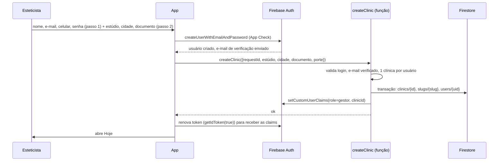
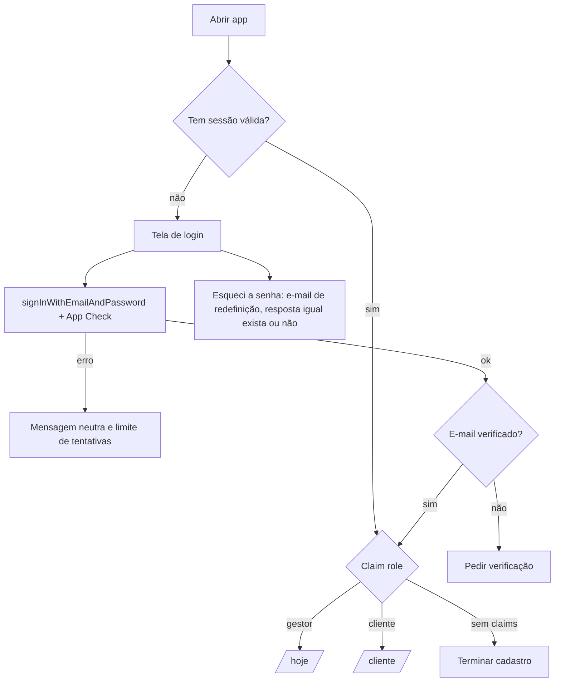
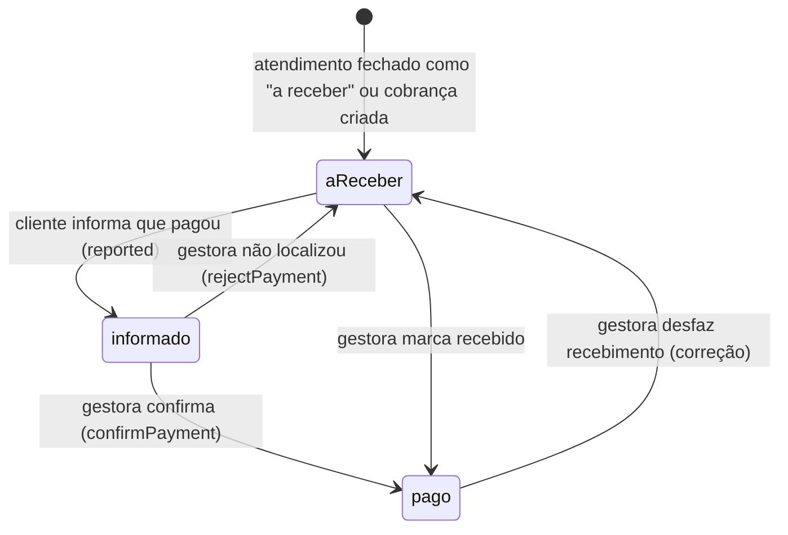
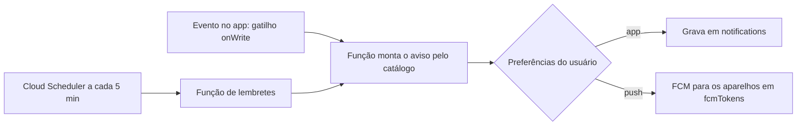

# Mapa de fluxos do EstetBoost.

Projeto. Cada fluxo mostra quem chama, o que valida o servidor, o que é atômico e o que acontece se falhar. Os nomes de função (`createClinic`, `acceptInvite`…) são as Cloud Functions callable previstas em [ARQUITETURA.md](./ARQUITETURA.md). As telas e serviços citados já existem no app.

Regras gerais de robustez:

- **Idempotência**: toda função recebe um `requestId`; repetir a chamada (rede ruim, toque duplo) não duplica nada.
- **Atomicidade**: o que mexe em várias coleções (fechar atendimento, confirmar pagamento) usa **transação** do Firestore.
- **Falha visível**: erro de servidor vira mensagem clara na tela e nada fica pela metade.
- **Offline**: leituras vêm do cache; escritas de rascunho entram na fila local do SDK e sincronizam ao voltar.

## 1. Criar conta da esteticista (nasce a clínica)

Tela: `components/auth/signup-flow.tsx` (2 passos).



Falhas tratadas: e-mail já existe (mensagem neutra), função cai depois de criar o usuário (login mostra "terminar cadastro" e repete `createClinic` com o mesmo `requestId`), slug em uso (gera `studio-bia-2`).

## 2. Cadastro da cliente por link ou credencial

Telas: link `/?p=slug` e `/?convite=CODIGO` → `components/auth/client-invite-form.tsx`. Credenciais são geradas em Credenciais/Configurações (`components/eb/client-invite.tsx`).

```mermaid
sequenceDiagram
  participant G as Gestora
  participant C as Cliente
  participant App as App
  participant Fn as Funções
  participant FS as Firestore
  G->>Fn: createInvite({nome?, celular?})
  Fn->>FS: invites/{hash}: clinicId, validade 7 dias (código só volta uma vez para a tela)
  G->>C: envia link ou código (WhatsApp)
  C->>App: abre o link (App Check)
  App->>FS: slugs/{slug} -> nome público da clínica
  C->>App: nome, celular, e-mail, senha
  App->>Fn: acceptInvite({requestId, código|slug, dados})
  Fn->>Fn: código válido, não usado, não expirado, não cancelado, limite de tentativas
  Fn->>FS: transação: marca uso, clients/{id} (clinicId), users/{uid}
  Fn->>Fn: claims role=cliente, clinicId, clientId
  Fn->>FS: notifications (gestora: nova cliente; cliente: boas-vindas), activity
  Fn-->>App: ok, entra na área da cliente
```

Regras: resposta **genérica** para código inválido; cadastro pelo link fixo não precisa de código mas tem limite por aparelho/IP; a filiação vem do servidor, não do navegador. Se a cliente já foi cadastrada pela gestora (mesmo e-mail), `acceptInvite` **vincula** ao registro existente em vez de duplicar.

## 3. Login, sessão e recuperação



- Token renova sozinho a cada hora; se a conta for desativada ou a senha trocada, o próximo refresh falha e o app volta ao login.
- `RoleGate` (já existe) passa a ler o papel das **claims**, nunca de dado editável.

## 4. Horários (agenda)

```mermaid
stateDiagram-v2
  [*] --> pendente: cliente solicita (requestAppointment)
  [*] --> confirmado: gestora agenda (scheduleAppointment)
  pendente --> confirmado: gestora aprova
  pendente --> cancelado: gestora recusa
  confirmado --> confirmado: cliente confirma presença
  confirmado --> remarcacao: cliente propõe nova data
  remarcacao --> confirmado: gestora aprova ou recusa
  confirmado --> cancelado: cancelamento (>24 h direto; <24 h pede aprovação)
  confirmado --> realizado: atendimento finalizado
```



- Disponibilidade vem de `config/hours`, `blocks` e horários ocupados (`lib/availability.ts`). **No servidor** o gatilho revalida conflito de horário (dois pedidos simultâneos no mesmo horário: o segundo recebe "horário ocupado").
- Cada passo grava `activity` e gera notificação pelo catálogo `notification-events.ts`.

## 5. Atendimento (rascunho até o fechamento)

```mermaid
sequenceDiagram
  participant G as Gestora
  participant App as App (session-screen)
  participant FS as Firestore
  participant St as Storage
  participant Fn as completeSession
  G->>App: escolhe a cliente
  App->>FS: sessions/{id} status=draft (autosave a cada alteração)
  G->>App: fotos antes/depois
  App->>St: upload (regras: só gestora da clínica, imagem até 5 MB)
  App->>FS: photos/{id} metadados (tipo, sessaoId)
  G->>App: procedimentos, produtos, pagamento
  G->>App: Finalizar
  App->>Fn: completeSession({requestId, sessionId, cuidados, retorno})
  Fn->>FS: transação
  Note over Fn,FS: sessão=done · agenda=done · ledger (entrada ou a receber) · estoque baixa · care · retorno sugerido
  Fn->>FS: notifications (cliente: cuidados; gestora: alerta de estoque/margem), activity
  Fn-->>App: ok
```

Falhas tratadas: produto sem estoque suficiente (a função recusa e informa qual), fechar duas vezes (idempotente por `sessionId`), sem internet no fechamento (botão fica "pendente" e reenvia; rascunho nunca se perde).

Correção/exclusão de atendimento finalizado (`editFinishedSession`, `deleteFinishedSession`) também passam a função, para ajustar caixa, agenda e estoque juntos e deixar registro em `activity`.

## 6. Pagamentos



- A cliente só escreve o campo `reported`; **só a gestora** muda o estado financeiro (regras + função).
- Confirmar gera lançamento de entrada, notificação à cliente e `activity` na mesma transação.

## 7. Fotos

- Upload: o app reduz a imagem (`shrinkImage`), envia ao Storage; uma função remove EXIF e grava metadados.
- Exibição: o app pede `signedPhotoUrl`; a função só devolve URL (vida curta, ex. 10 min) se for gestora da clínica ou a própria cliente **e** houver `imageConsent`.
- Antes/depois: pareados por `sessaoId` e `tipo`, exibidos na aba Fotos da ficha.

## 8. Avisos (push e central)



`ruleKey` impede duplicar (mesma regra, mesmo dia). Detalhes de textos e regras: `docs/NOTIFICACOES-FIREBASE.md`.

## 9. Direitos do titular (LGPD)

- **Exportar**: gestora pede em Ficha → Exportar prontuário (hoje arquivo de texto local) → função `exportClientData` gera arquivo e registra `activity`.
- **Excluir**: `deleteClientData` apaga ficha, anamnese, fotos, agendas e cobranças pessoais da cliente, mantendo apenas o que a lei obriga a guardar (por exemplo, lançamentos fiscais, anonimizados). Registro de auditoria permanece sem dados pessoais.
- A cliente pode solicitar pelo perfil; a gestora é avisada e tem prazo para atender.

## 10. Mapa de telas por papel

| Papel     | Rotas                                                                                                                            | Dados lidos               |
| --------- | -------------------------------------------------------------------------------------------------------------------------------- | ------------------------- |
| Visitante | `/` (login, criar conta, link/credencial)                                                                                        | Só `slugs` (nome público) |
| Gestora   | `/hoje`, `/agenda`, `/clientes`, `/clientes/:id`, `/atendimento/*`, `/gestao`, `/notificacoes`, `/credenciais`, `/configuracoes` | Toda a clínica            |
| Cliente   | `/cliente`, `/cliente/agenda`, `/cliente/evolucao`, `/cliente/perfil`                                                            | Só os próprios dados      |

`RoleGate` redireciona papel errado; as **regras** garantem que, mesmo burlando a tela, o dado não vem.
