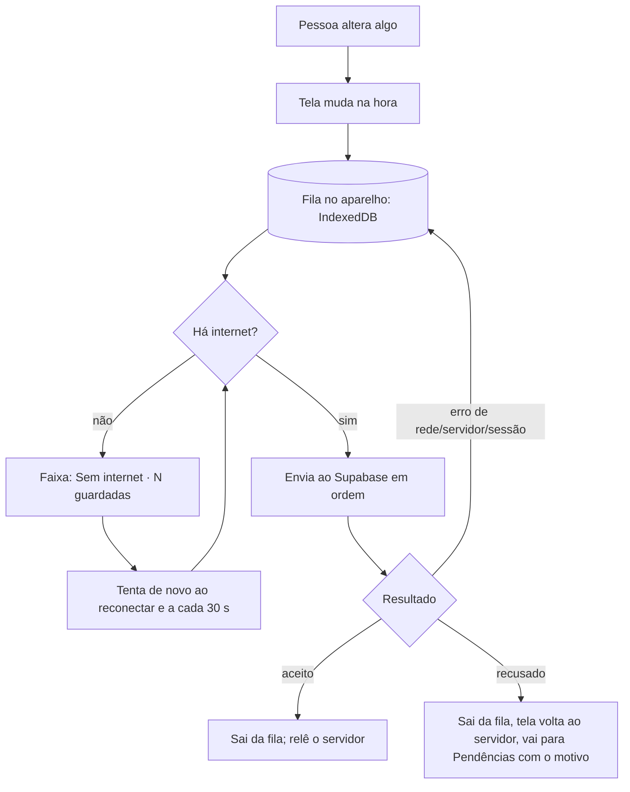

# Modo sem internet e protocolo de erros

Decisão: o EstetBoost. é **offline-first**. O banco (Supabase) continua sendo a fonte da verdade e o ponto de encontro entre as pessoas, mas cada aparelho guarda uma **cópia** dos dados e uma **fila** de alterações. Sem internet, o app abre e funciona; ao reconectar, a fila é enviada sozinha, em ordem.

## 1. Qual solução (e por que)

| Opção                                                                             | O que é                                                                                                              | Veredito                                                                                                                                                  |
| --------------------------------------------------------------------------------- | -------------------------------------------------------------------------------------------------------------------- | --------------------------------------------------------------------------------------------------------------------------------------------------------- |
| A. Só leitura offline                                                             | Guarda uma cópia para consultar; escrever exige internet                                                             | Pouco: a esteticista perde atendimento feito sem sinal                                                                                                    |
| **B. Cópia + fila de alterações (escolhida)**                                     | Cópia dos dados no aparelho (IndexedDB) e fila persistente de gravações e de funções do servidor, reenviada em ordem | **Cobre o uso real** (atender, agendar, cadastrar sem sinal), cabe no código atual e dá para testar                                                       |
| C. Banco local completo com motor de sincronização (PowerSync, ElectricSQL, RxDB) | SQL local nas duas pontas, sincronização e resolução de conflitos prontas                                            | Mais robusta para muita edição concorrente, mas troca a arquitetura inteira e adiciona um serviço. Fica como evolução se o volume de conflitos justificar |

## 2. Como funciona

- **Ao abrir:** mostra na hora a cópia do aparelho (cada coleção tem a sua) e atualiza em segundo plano. A tela principal abre em ~0,2 s com ou sem internet.
- **Cópia e fila ficam no IndexedDB**, por pessoa (`snap:<uid>:<coleção>`, `outbox:<uid>`). Fechar o app ou o celular não perde nada.
- **Ordem preservada:** a fila é única e em ordem (a cliente é criada antes do horário dela; o rascunho do atendimento vai antes de "fechar atendimento"). Alterações seguidas no mesmo registro viram uma só; criado e apagado sem internet nunca chega ao servidor.
- **Funções do servidor** (fechar/corrigir/apagar atendimento, cliente informar pagamento, confirmar presença, pedir cancelamento/remarcação…) também entram na fila e executam ao reconectar. A tela diz "guardado neste aparelho".
- **Foto sem internet:** o arquivo fica no aparelho, aparece na hora e sobe quando a conexão voltar.
- **Sessão:** o login continua guardado; sem internet o app abre com a última identidade conhecida (nome, papel e permissões) sem esperar a rede.
- **Sair da conta:** apaga a cópia local da pessoa (dados de saúde não ficam no aparelho). Se houver alterações na fila, o app avisa que sair as perde e pede confirmação.

## 3. Protocolo de erros

Todo erro de rede ou do banco cai em **uma** classe (`src/lib/errors.ts`), e cada classe tem **um** comportamento:

| Classe                      | Exemplos                                              | O app faz                                                                                    | Pessoa vê                                                                            |
| --------------------------- | ----------------------------------------------------- | -------------------------------------------------------------------------------------------- | ------------------------------------------------------------------------------------ |
| `rede`                      | Sem internet, servidor inalcançável, tempo esgotado   | Mantém na fila; tenta ao reconectar e a cada 30 s                                            | Faixa "Sem internet · N alterações guardadas"                                        |
| `sessao`                    | Login expirado ou revogado (401, JWT expirado)        | Tenta renovar uma vez; se não der, para o envio e preserva a fila                            | Faixa "Sessão expirada. N guardadas · Entrar de novo" (entrar de novo retoma a fila) |
| `servidor` / `desconhecido` | 5xx, indisponibilidade                                | Fila com esperas crescentes (5 s, 15 s, 45 s, 2 min, 5 min); na 5ª falha vai para Pendências | Faixa "Enviando…"; depois, Pendências                                                |
| `permissao`                 | RLS recusou, 403, 0 linhas atualizadas                | Sai da fila, a tela volta ao que está no servidor                                            | Aviso + Pendências: "Você não tem permissão para essa alteração"                     |
| `conflito`                  | Registro repetido, horário já ocupado (409, 23505)    | Idem                                                                                         | Aviso + Pendências: "Esse registro já existe ou o horário foi ocupado"               |
| `invalido`                  | Campo obrigatório, valor recusado (400, 22xxx, 23xxx) | Idem                                                                                         | Aviso + Pendências: "O servidor não aceitou os dados"                                |

**Pendências** (Faixa → "Ver"): lista o que está aguardando e o que o servidor não aceitou, com **Tentar de novo** (recoloca na tela e reenvia) e **Descartar**. Avisos e histórico (itens "silenciosos") nunca incomodam: se recusados, somem.

**Erros de tela:** qualquer falha inesperada de renderização cai numa tela em português com _Tentar de novo_, _Voltar ao início_ e _Copiar diagnóstico para o suporte_ (últimos erros do aparelho, sem dados de clientes).

**Falhas que o usuário provoca** (senha errada, código inválido, e-mail repetido) têm mensagem própria no formulário (`src/services/auth.service.ts`).

## 4. Fluxos por situação

| Situação                                  | O que acontece                                                                                                                                                                  |
| ----------------------------------------- | ------------------------------------------------------------------------------------------------------------------------------------------------------------------------------- |
| Atender uma cliente sem sinal             | Wizard funciona; rascunho salvo na fila; "Finalizar" fica guardado ("será concluído quando a conexão voltar"); ao reconectar o servidor lança caixa, estoque, cuidados e avisos |
| Cliente pede horário sem sinal            | O pedido fica na fila e chega à gestora ao reconectar. Horários ocupados vêm da última consulta; se alguém ocupou antes, o pedido volta como conflito                           |
| Duas pessoas editam o mesmo registro      | Vale a última gravação que chegar ao servidor. Horário no mesmo instante: o banco recusa a segunda (conflito)                                                                   |
| Permissão retirada com alterações na fila | O servidor recusa; vão para Pendências com o motivo                                                                                                                             |
| Conta desativada pela gestora             | O próximo envio é recusado e o app avisa e sai (acesso desativado)                                                                                                              |
| App aberto em dois aparelhos              | Cada um tem a sua fila; tempo real e releitura a cada 30 s mantêm os dois iguais                                                                                                |

## 5. O que NÃO funciona sem internet

- Entrar na conta pela primeira vez, criar conta, aceitar credencial, recuperar senha.
- Gerar credencial de cliente ou de funcionária, mudar permissões da equipe e desativar pessoas (exigem resposta do servidor).
- Receber push e os lembretes agendados (são do servidor; chegam ao reconectar).
- Ver fotos antigas: as imagens vêm com endereço assinado de vida curta; sem internet só aparecem as que o navegador ainda guardou e as tiradas offline.
- Dois pontos de atenção de segurança: a cópia no aparelho não é criptografada (vale a trava do aparelho; é apagada ao sair da conta) e o IndexedDB de um site aberto no navegador comum pode ser limpo pelo próprio sistema se o aparelho ficar sem espaço (instalado como app, o sistema protege mais).

## 6. Testes

`bun run test` cobre: fila sem internet em ordem, reinício com fila e cópia, funções do servidor em fila, criar-e-apagar sem enviar, recusa vira Pendência (permissão, conflito), erro de servidor com nova tentativa, tentar de novo e descartar. No navegador (Chromium com service worker real): abrir offline, cadastrar offline, fechar e reabrir sem perder, voltar a internet e enviar.
